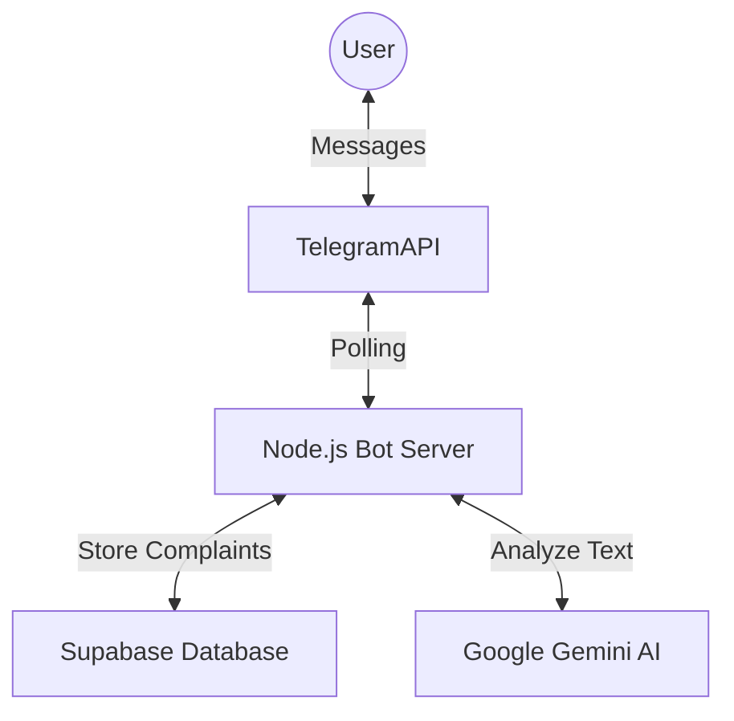

# CivicPulse Bot - Development and Connection Guide

This guide explains how the **CivicPulse** Telegram bot was developed and how it connects to its backend services (Supabase and Google Gemini).

## 1. Architecture Overview

The bot acts as a bridge between the User (on Telegram) and the Backend Systems.



## 2. Key Components

### A. The Bot Framework (Telegraf)
We used `telegraf`, a popular Node.js library for Telegram bots.
- **Polling:** The bot constantly asks Telegram "Do I have new messages?" (Long Polling).
- **Scenes:** We used "Wizard Scenes" (`src/scenes.js`) which allow for step-by-step conversations (Step 1: Description -> Step 2: Photo -> Step 3: Location).

### B. The Brain (Google Gemini AI)
Instead of hard-coded rules, we use AI to understand the user.
- **File:** `src/ai.js`
- **Process:**
  1. User sends text (e.g., "Big hole in road").
  2. Bot sends this to Gemini API with a "System Prompt" telling it to act as a civic assistant.
  3. Gemini analyzes the text and returns a JSON object with `Category: Roads`, `Priority: High`, etc.

### C. The Database (Supabase)
We use Supabase (PostgreSQL) to store the data.
- **File:** `src/supabase.js`
- **Connection:** We connect using the `supabase-js` client.
- **Network Bypass:** Since you are on a restricted network, we modified the connection to use a custom `https.Agent` that ignores SSL errors, allowing it to punch through the firewall.

## 3. How We Connected Everything

### Step 1: Credentials (`.env`)
We stored all secret keys in a `.env` file so the code doesn't expose them.
```env
BOT_TOKEN=844...       <-- From BotFather (Telegram)
SUPABASE_URL=https...  <-- From Supabase Settings
SUPABASE_KEY=eyJh...   <-- From Supabase Settings
GEMINI_API_KEY=AIza... <-- From Google AI Studio
```

### Step 2: Connection Logic
1.  **Telegram:** `bot.launch()` in `index.js` starts the connection to Telegram's servers.
2.  **Supabase:** `createClient()` in `supabase.js` establishes the DB connection. We added a special "Custom Fetch" to handle your network's specific restrictions.
3.  **Gemini:** `genAI.getGenerativeModel()` in `ai.js` authenticates with Google.

## 4. The Flow of Data
1.  **User** starts `/report`.
2.  **Bot** asks for description.
3.  **User** replies.
4.  **Bot** sends text to **Gemini**.
5.  **Gemini** extracts details (Category, Priority).
6.  **Bot** asks for Photo & Location.
7.  **Bot** bundles all data and `INSERT`s it into **Supabase** `complaints` table.
8.  **Bot** gives User a `Reference ID` (e.g., CMP-123).

## 5. Troubleshooting Network Issues
Your development environment had a "Captive Portal" (Firewall) that blocked standard secure connections.
- **Fix:** We wrote a custom script (`check_connection.js`) to diagnose this.
- **Patch:** We forced the bot to use an "Insecure HTTPS Agent" (`rejectUnauthorized: false`) to bypass the firewall's certificate interception.
